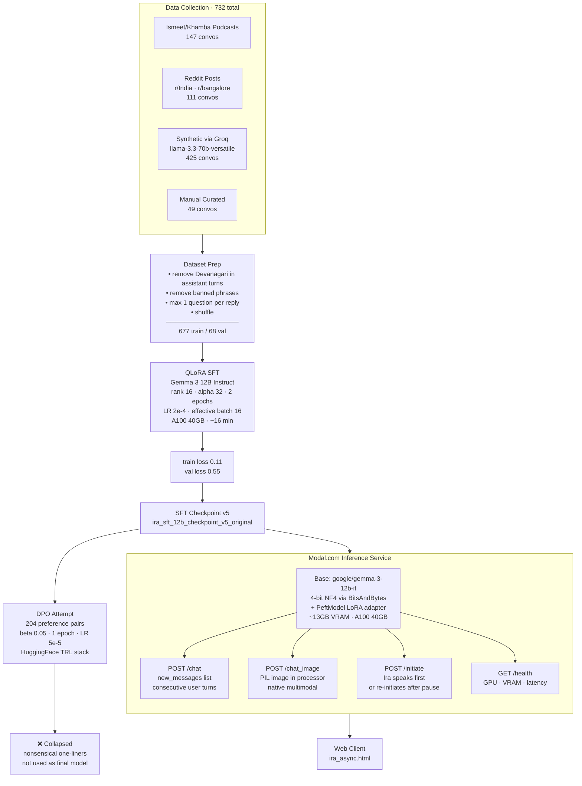
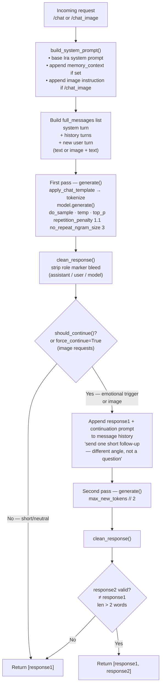
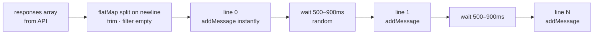

# Ira Pipeline Diagrams

---

## 1. Full Training & Serving Pipeline



---

## 2. Backend Generation Flow



---

## 3. Client Message Flow

```mermaid
flowchart TD
    INPUT["User presses Enter\nsendMessage()"]

    INPUT --> IMGCHECK{"selectedImage\nattached?"}

    IMGCHECK -->|Yes| IMGPATH["handleImageSend(text, pendingBatch)"]
    IMGCHECK -->|No| INFLIGHTCHECK{"flushInProgress?"}

    INFLIGHTCHECK -->|Yes| BUFFER["addToBuffer(text)\nshow ghost chip in buffer strip\n+ cancel button per chip"]
    INFLIGHTCHECK -->|No| CHAT["addMessage('user', text)\nshow bubble in chat"]

    BUFFER --> PENDING["pendingMessages.push(text)"]
    CHAT --> PENDING

    PENDING --> GATHER{"gatherStarted?"}

    GATHER -->|No - debounce phase| DEBOUNCE["clearTimeout(debounceTimer)\nsetTimeout(4000ms)\nwaiting for typing pause"]
    DEBOUNCE -->|pause detected| GATHERSTART["gatherStarted = true\ngatherStart = Date.now()\nsetTimeout(5000ms)"]

    GATHER -->|Yes - gather phase| GATHERRESET["reset gather window\nrespect 5s cap from gatherStart\nfire immediately if cap hit"]

    GATHERSTART --> FIREGATHER["fireGather()\nbatch = [...pendingMessages]\npendingMessages = []"]
    GATHERRESET --> FIREGATHER

    FIREGATHER --> FLUSH

    subgraph FLUSH["flushPending(batch)"]
        direction TB
        F1{"flushInProgress?"}
        F1 -->|Yes| QUEUE["queuedBatch = [...queuedBatch, ...batch]\nhold — drain after current call"]
        F1 -->|No| F2["flushInProgress = true\ndrainMsgBuffer()\naddTyping()"]
        F2 --> APICHAT["POST /chat\nhistory + new_messages\ntemperature from slider\nmemory_context if set"]
        APICHAT --> RESP["removeTyping()\nhistory.push user turn\nawait showLines(responses)\nhistory.push assistant turn"]
        RESP --> F3["flushInProgress = false"]
        F3 --> DRAIN{"queuedBatch?"}
        DRAIN -->|Yes| DRAINNEXT["next = queuedBatch\nqueuedBatch = null\nawait flushPending(next)"]
        DRAIN -->|No| DONE["done"]
    end

    subgraph IMGPATH["handleImageSend()"]
        direction TB
        I1["flushInProgress = true\nfileToBase64(imageFile)\nrender img-card in chat\nclearImage() pending strip\naddTyping()"]
        I1 --> I2{"pendingBefore\nmessages?"}
        I2 -->|Yes| I3["await flushPending(pendingBefore)\n(flush text context first)"]
        I2 -->|No| I4["POST /chat_image\nhistory + message\nimage_base64 + media_type"]
        I3 --> I4
        I4 --> I5["removeTyping()\nhistory.push user turn\nawait showLines(responses)\nhistory.push assistant turn\nflushInProgress = false"]
        I5 --> I6{"queuedBatch?"}
        I6 -->|Yes| I7["drain queuedBatch\nvia flushPending"]
        I6 -->|No| I8["done"]
    end
```



---

## 4. showLines — Staggered Bubble Reveal



---

## 5. Consecutive Message Timing

```
User:  ──●────●──────────────────●──────────────●───────────────────────────────────▶
          msg1 msg2               msg3           msg4
                  └──4s debounce──┘
                                   └─gather starts─┤
                                                    └──5s gather window──┘
                                                                          └─► API call
                                                                              new_messages:
                                                                              [msg1, msg2, msg3, msg4]
```
